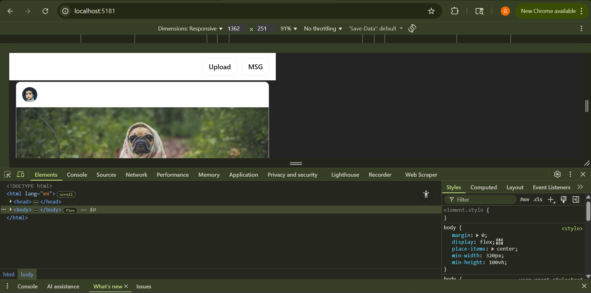

	          Lab 2 - React Tutorial: Building a Mini-Instagram
PART 0:
1.	I created the React project using Vite with the command:
npm create vite@latest mini-insta -- --template react
2.	Then, I navigated into the project folder using cd mini-insta.
3.	I installed all dependencies by running npm i.
4.	After that, I started the development server using npm run dev.
5.	The app successfully launched at http://localhost:5173/.
6.	The browser displayed the default Vite + React screen, confirming that the development server and Hot Module Replacement were working properly.

 
PART 1:Data Model
1.	I created a new file named posts.js inside the src/data folder.
2.	In this file, I defined a variable called seedPosts, which contains an array of two post objects.
3.	Each post object includes details such as post ID, author name, avatar image, post image, title, number of likes, whether I liked it, and comments.
4.	For every post, I also added a comments array containing comment ID, author, and text.
5.	I then imported this dataset into App.jsx to test if it was connected properly.
6.	To verify, I displayed the total number of posts on the page.
7.	When I ran the project using npm run dev, the browser showed “Mini Insta” and “Seed posts loaded: 2”, confirming the data was working correctly.
Refered image :
 
PART 2: App State & Feed
1.	Created the main state in App.jsx using the useState() hook and initialized it with the seedPosts data from posts.js.
2.	Made a new components folder inside src and added two new files — Navbar.jsx and Feed.jsx.
3.	The Navbar component displays the app title “Mini Insta” with basic inline CSS styling.
4.	The Feed component takes the posts and setPosts props and maps through the posts, preparing to render each post card later.
5.	Linked both Navbar and Feed components in App.jsx and displayed them inside the main layout.
6.	Ran the project using npm run dev — the app successfully loaded and displayed the “Mini Insta” heading.

 
The app successfully loads the Navbar and Feed components. Since the PostCard component has not yet been implemented, Vite shows a missing import error.

PART 3: 

                  
Check point :
                
#check point completed as we can see, like in this image and count and its visible and two pictures are also visible 
 
And there is no errors or warnings. Here part 3 is completed
PART 4: — Comments (controlled form)
Here we can see the first comment.
 
 
 
PART 5: Composer (new post)
1.	I built a Composer component with two controlled inputs: Image URL (required) and Caption.
2.	Prevents default, trims values, and validates that Image URL isn’t empty.
3.	Constructs a new post object: { id: crypto.randomUUID(), author: 'you', avatar: 'https://i.pravatar.cc/100?u=you', imageUrl, caption, likedByMe:false, likeCount:0, comments:[] }.
4.	Prepends it to the feed with setPosts(prev => [post, ...prev]).
5.	Clears the inputs to confirm success.
6.	I rendered <Composer setPosts={setPosts} /> above <Feed /> in App.jsx, so new posts appear at the top.

This is the URL bar to paste URL to make a POST
 
This is an image posted by me with a caption.

PART 6: Routing & Persistence
1. Added client-side routing with react-router-dom:
2. Wrapped the app in <BrowserRouter> (in main.jsx).
3. Declared routes in App.jsx:
     a]/ → Composer + full Feed
     b]/u/:handle → Profile view that filters posts by author handle
     c]Fallback * → “Not found”
4] Built Profile.jsx to read handle via useParams() and render a filtered <Feed />.
5] Turned the author handle in PostCard.jsx into a <Link to={/u/${post.author}}>@author</Link>.
6.Enabled persistence with localStorage so posts survive refresh:
7.Hydration on load: initialized state from localStorage.
8.Save on change: wrote posts to localStorage whenever they update.
9.Used a lazy initializer in useState to avoid flashing seed data and to ensure stored posts load before first render.
10: Tested:
		Added a post via Composer, refreshed, post still there.
		Clicked an author handle, navigated to /u/<handle> and saw only that author’s posts.
 
home page for particular user
 
Polish: After doing everything this is how the page looks and this is a zoomed out picture.
 
DevTools Elements view

hover vid
<video src="public/screenshots/hover.mp4" width="600" controls>
  Your browser does not support the video tag.
</video>

 
 

